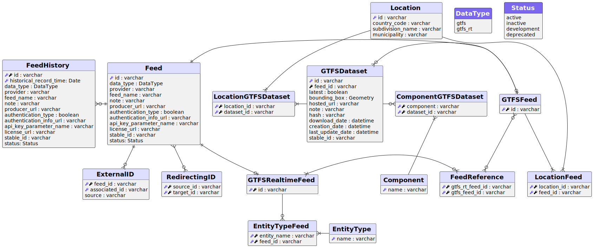
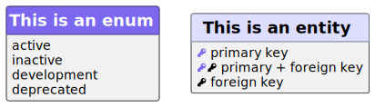

# Mobility Database

### Mobility Database Schema


#### Schema legend


### Local database using Docker
To create a local instance of the database simply run:
```shell
$ cd database/local 
$ docker-compose up -d --force-recreate
```