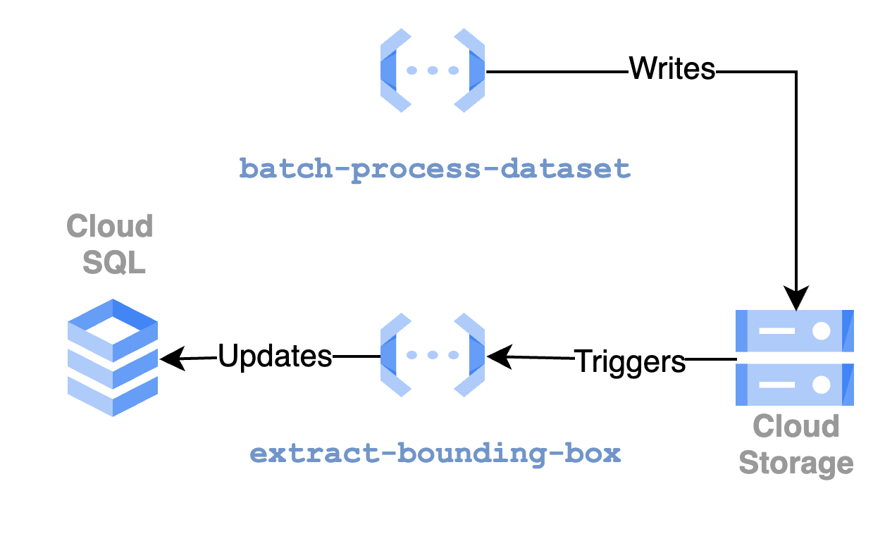
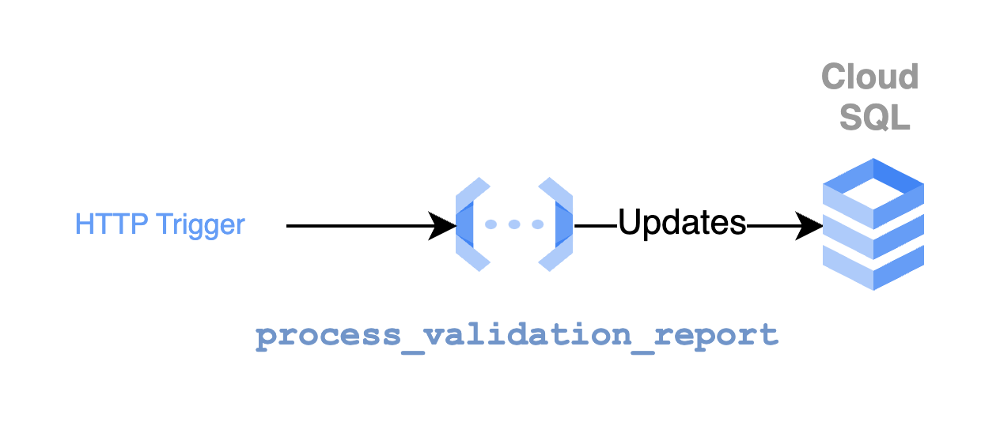
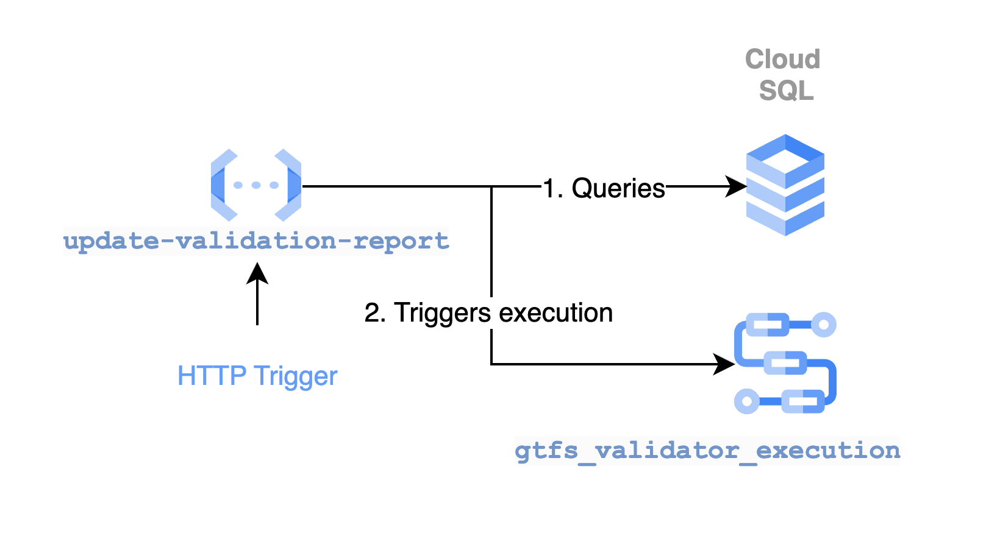

# Historical Datasets Batch Processing Documentation

## Overview

This documentation provides an in-depth guide to the workflow used for batch processing and storing historical datasets in a Google Cloud Platform (GCP) bucket. Our solution combines Cloud Scheduler, HTTP-triggered functions, and Pub/Sub-triggered functions (along with those triggered by storage events) to efficiently manage data processing.

## Workflow Overview
The diagram below offers a high-level view of the workflow:

### Cloud Scheduler: `dataset-batch-job`

The `dataset-batch-job` Cloud Scheduler is a pivotal component of our workflow. It is configured to run at specific intervals, which can vary based on the environment setting. Its primary role is to initiate the data processing sequence by making an HTTP call to the `batch-datasets` function.

### Workflow Description
Currently, there is a single workflow in place:

- **`gtfs-validator-execution`**: This workflow is triggered when a new dataset is created in the `mobilitydata-datasets` bucket. The dataset path must match the pattern `mdb-*/mdb-*/mdb-*.zip`. It validates the dataset and updates the corresponding entity in the database with the validation report by calling the `process-validation-report` HTTP function.

### Function Descriptions

The cloud functions each play a specific role within the workflow:

1. **`batch-datasets`**: This HTTP-triggered function collects information about feeds and publishes it to the Pub/Sub topic for further processing. It serves as the central coordinator for dataset updates, ensuring new data is properly queued.
   
    More information about the `batch-datasets` function can be found [here](../../functions-python/batch_datasets/README.md).

2. **`batch-process-dataset`**: Triggered via Pub/Sub, this function handles actual data processing by downloading, comparing with previous versions, and updating the system with the latest dataset information. The standardized URL format `<bucket-url>/<feed_stable_id>/<dataset_id>.zip` ensures data consistency and predictability.
   
    More information about the `batch-process-dataset` function can be found [here](../../functions-python/batch_process_dataset/README.md).

3. **`extract-bounding-box`**: Triggered when a dataset with the pattern `mdb-*/mdb-*/mdb-*.zip` is added to the `mobilitydata-datasets` bucket, this function reads the `stops.txt` file to extract the dataset's bounding box (min/max latitude/longitude). It updates the `bounding_box` field of the appropriate entity in the PostgreSQL database.
   
    More information about the `extract-bounding-box` function can be found [here](../../functions-python/extract_bb/README.md).

4. **`process-validation-report`**: This HTTP-triggered function is called by the `gtfs-validator-execution` workflow. It adds validation report entities to the database and links them to the appropriate dataset.
   
   More information about the `process-validation-report` function can be found [here](../../functions-python/validation_report_processor/README.md).

5. **`update-validation-report`**: This function triggers batch validation through the GTFS Web Validator backend services, calling the `gtfs-validator-execution` workflow for any `latest` datasets lacking a recent or updated validation report.
   
   More information about the `update-validation-report` function can be found [here](../../functions-python/update_validation_report/README.md).