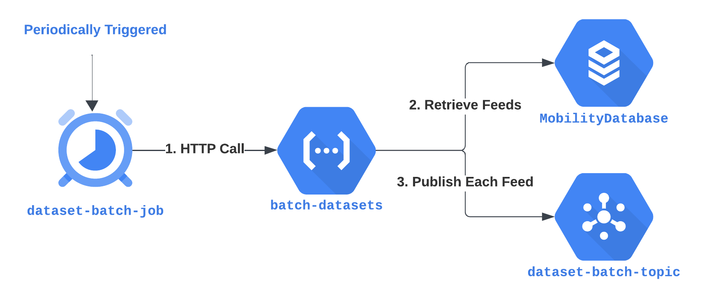

# Historical Datasets Batch Processing Documentation

## Overview

This document provides a comprehensive overview of the workflow for batch processing and storing historical datasets in a Google Cloud Platform (GCP) bucket. Our process strategically combines GCP Scheduler, HTTP-triggered functions, and Pub/Sub-triggered functions to ensure efficient and reliable data handling.

## Workflow Description
The following schema provides a high-level overview of the workflow process:


### Cloud Scheduler: `dataset-batch-job`

The `dataset-batch-job` in Cloud Scheduler is a pivotal component of our workflow. It is configured to run at specific intervals, which can vary based on the environment setting. Its primary role is to initiate the data processing sequence by making an HTTP call to the `batch-datasets` function.

### Function Descriptions

Each cloud function encapsulates a specific part of the workflow:
- `batch-datasets`: HTTP-triggered function that retrieves information about feeds and publishes this data to the Pub/Sub topic for further processing. It serves as the orchestrator for dataset updates, ensuring that new data is queued for processing.

- `batch-process-dataset`: Pub/Sub-triggered function that performs the actual data processing. It downloads the feed data, compares it to the previous version, and, if necessary, updates the dataset information in the system. This function is crucial for maintaining the latest data within our storage and ensuring that users have access to the most current datasets.

#### HTTP Cloud Function: `batch-datasets`


This function serves as the starting point for the batch processing workflow. It queries for active feeds and publishes their information to a specified Pub/Sub topic. The messages contain details necessary to process each feed, including URLs, feed IDs, and authentication details if applicable. The structure of the message it sends is detailed as follows:

```json
{
  "execution_id": "<execution_id>",
  "producer_url": "<producer_url>",
  "feed_stable_id": "<feed_stable_id>",
  "feed_id": "<feed_id>",
  "authentication_type": "<authentication_type>",
  "authentication_info_url": "<authentication_info_url>",
  "api_key_parameter_name": "<api_key_parameter_name>",
  "dataset_id": "<dataset_id>",
  "dataset_hash": "<dataset_hash>"
}
```

#### Pub/Sub Cloud Function: `batch-process-dataset`


Subscribed to the topic set in the `batch-datasets` function, `batch-process-dataset` is triggered for each message published. It handles the processing of each feed individually, ensuring data consistency and integrity. The function performs the following operations:

1. **Download Data**: It retrieves the feed data from the provided URL.
2. **Compare Hashes**: The SHA256 hash of the downloaded data is compared to the hash of the last stored version to detect changes.
   - If the hash is unchanged, the dataset is considered up-to-date, and no further action is taken.
   - If the hash has changed, it is indicative of an update, and a new `Dataset` entity is created and stored with the corresponding feed information.

The URL format for accessing these datasets is standardized as `<bucket-url>/<feed_stable_id>/<dataset_id>.zip`, ensuring a consistent and predictable path for data retrieval.
