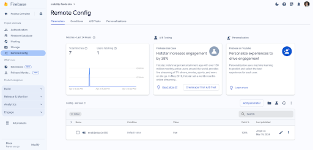
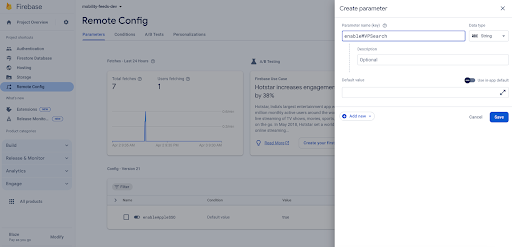
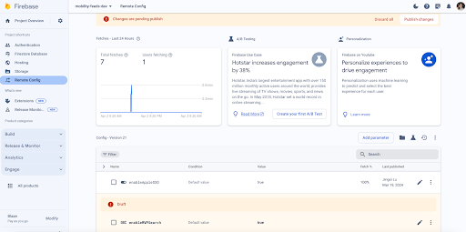
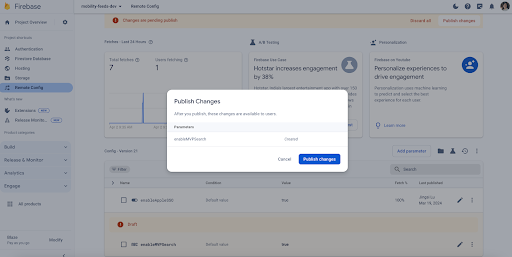
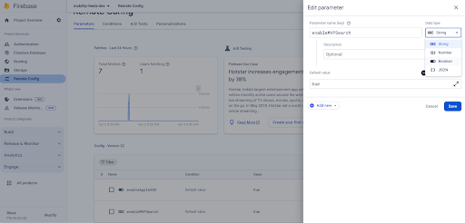
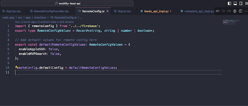
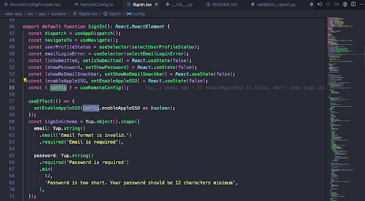

# How to Add a Feature Flag on Firebase

## 1. Go to Remote Config on Firebase

Navigate to the Remote Config section in your Firebase project.

## 2. Add a new parameter

Click the "Add parameter" button to create a new parameter.

## 3. Create the Feature Flag

Use the new parameter to create a feature flag.

Don't forget to publish your changes.

## 4. Edit the Feature Flag

You can edit the feature flag by clicking on the pencil editing button. After making your changes, click the "Save" button and publish your changes.

## 5. Update `RemoteConfig.ts`

In your code editor, open the `RemoteConfig.ts` file and add `enableMVPSearch` to `defaultRemoteConfigValues`.

## 6. Use the Feature Flag in Your Code

You can now use the feature flag in your code to control the behavior of your application.

