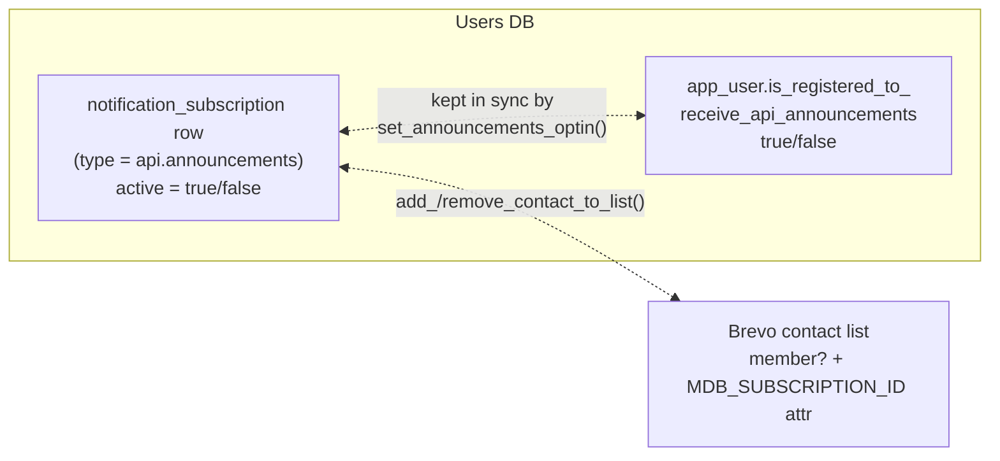
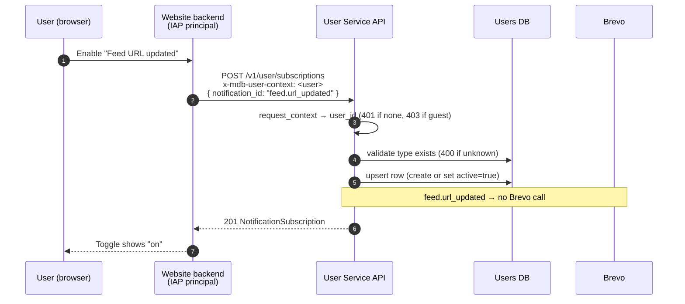
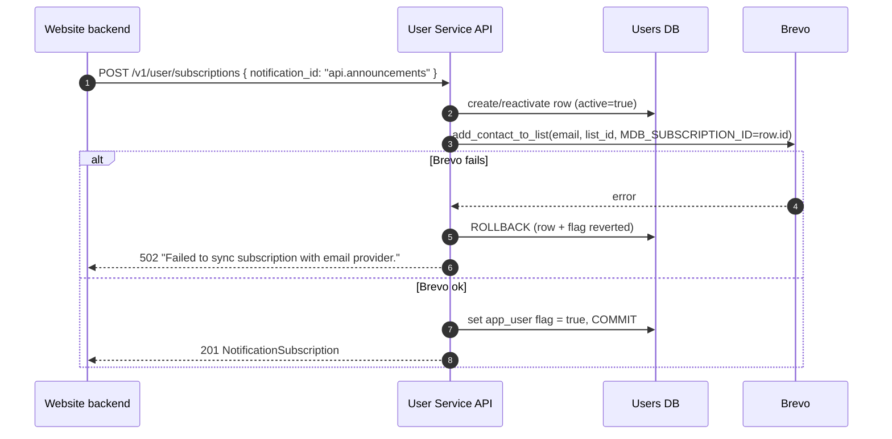
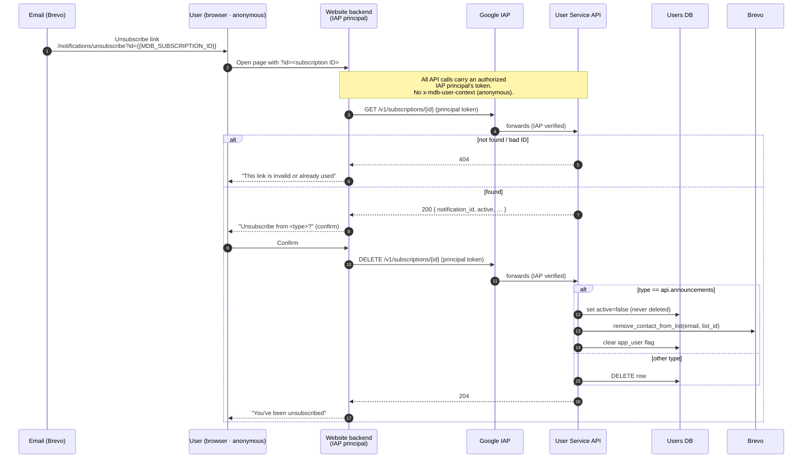
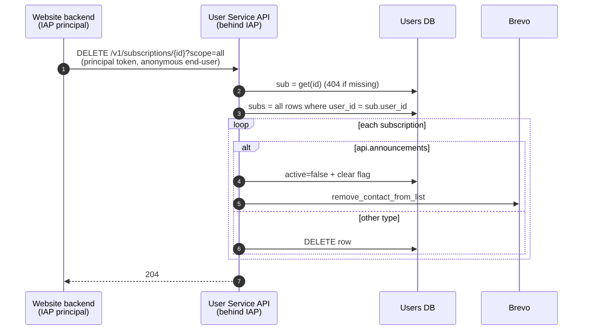

# Subscription & Unsubscribe Flows — End to End

This document describes how a user subscribes to and unsubscribes from
notifications across the website, the User Service API, the Users DB and Brevo.
It covers the logged-in account-screen flow, the email-link unsubscribe flow
(single subscription and all subscriptions), and the trust model that ties them
together.

For the delivery pipeline (dispatcher, Cloud Tasks, retries) see
[notifications.md](./notifications.md). This document is about **who is
subscribed to what** and how that state is changed — not how emails are sent.

Throughout this document, "**the subscription ID**" always means
`notification_subscription.id` — the subscription row's own primary key, a UUID
string. It is distinct from the user ID (`app_user.id`) and from the notification
type ID (`notification_type.id`, e.g. `feed.url_updated`).

## Table of Contents

1. [The two audiences](#the-two-audiences)
2. [Authentication model](#authentication-model)
3. [The core data model](#the-core-data-model)
4. [The `api.announcements` special case — three representations](#the-apiannouncements-special-case--three-representations)
5. [Endpoint inventory](#endpoint-inventory)
6. [Flow 1 — Subscribe (account screen)](#flow-1--subscribe-account-screen)
7. [Flow 2 — Unsubscribe / pause / resume (account screen)](#flow-2--unsubscribe--pause--resume-account-screen)
8. [Flow 3 — Unsubscribe from an email link](#flow-3--unsubscribe-from-an-email-link)
9. [Flow 4 — Unsubscribe from all](#flow-4--unsubscribe-from-all)
10. [The capability-URL security model](#the-capability-url-security-model)
11. [Integration points](#integration-points)

---

## The two audiences

There are two entirely different entry points to subscription management, and
they use two different sets of endpoints:

| | **Logged-in user** (website account screen) | **No end-user login** (email unsubscribe link) |
|---|---|---|
| Who | A logged-in user managing their own notifications | Anyone who received an email and clicked "unsubscribe" — no account, no login |
| End-user identity | Firebase / Bearer → `x-mdb-user-context` → `request_context.user_id` | None — the subscription ID in the URL scopes the action instead |
| Who calls the API | The website backend, server-side, on the user's behalf | The website backend, server-side, anonymously |
| Endpoints | `/v1/user/subscriptions*` (tag `users`) | `/v1/subscriptions/{id}` (tag `subscriptions`) |
| Can do | list, create, pause / resume, delete — for **their own** subscriptions only | fetch one, delete one, delete all — by subscription ID |

Keeping these separate is deliberate: the authenticated endpoints enforce
per-user ownership; the capability endpoints treat the unguessable subscription
ID as a bearer capability (the standard email-unsubscribe pattern).

---

## Authentication model

"Unauthenticated" here refers to the **end-user**, not the API call. The
Feeds / User Service API has **no open-internet endpoints**: every call must be
authenticated as an **authorized IAP principal** (a service account granted IAP
access). The website backend makes the calls server-side as such a principal;
the browser never calls the API directly.

- **Logged-in flows** — the backend calls the API with its IAP principal
  credential **plus** an `x-mdb-user-context` JWT (HS256, `S2S_JWT_SECRET`)
  identifying the end-user (`api/src/middleware/request_context.py`).
- **Email-link unsubscribe flow** — the end-user is anonymous, so there is **no**
  `x-mdb-user-context`. The backend still authenticates to IAP as an authorized
  principal and forwards the subscription ID. The `subscriptions` endpoints
  ignore user identity entirely and act on the subscription ID alone.

Consequently the `subscriptions` endpoints stay behind IAP like every other
endpoint, reached only by an authorized IAP principal; they are not exposed
unauthenticated at the edge.

---

## The core data model

Source of truth: `notification_subscription` in the **Users DB**
(`api/src/shared/users_database_gen/sqlacodegen_models.py`).

```
notification_subscription
  id                    TEXT  PK   ← the subscription ID: a UUID string
                                     (generate_unique_id()). This is the value that
                                     appears in email unsubscribe links.
  user_id               TEXT  FK → app_user.id  (ON DELETE CASCADE)
  notification_type_id  TEXT  FK → notification_type.id   e.g. 'feed.url_updated', 'api.announcements'
  active                BOOL  default true       ("paused" == active=false)
  cadence               TEXT  default 'weekly'   immediate | daily | weekly
  digest                BOOL  default true
  filter_params         JSONB nullable
  created_at / active_since  timestamps
```

- One row per `(user, notification_type)`. Idempotency is enforced in code
  (there is no DB unique constraint on `(user_id, notification_type_id)`).
- **The subscription ID (`id`) is the capability token.** It is a UUID and is the
  only value an anonymous caller presents to unsubscribe. It is mirrored into
  Brevo (see next section) so an email can embed it.

---

## The `api.announcements` special case — three representations

`api.announcements` is **not** delivered by the in-house dispatcher (the batch
planner deliberately skips it — see
[notifications.md](./notifications.md#dispatcher-tasks-cloud-tasks-fan-out)). It
is delivered by **Brevo campaigns** to a Brevo contact list. As a result, an
announcements opt-in is stored in **three places that must always agree**:



The single function that reconciles all three is `set_announcements_optin()` in
`api/src/user_service/impl/subscription_helpers.py`. It is idempotent:

- **subscribe** → create / reactivate the row, `add_contact_to_list(...)` with the
  contact attribute **`MDB_SUBSCRIPTION_ID` = the subscription ID**, set the flag
  `true`. The whole change is atomic — if Brevo fails the row and flag roll back.
- **unsubscribe** → `remove_contact_from_list(...)`, set `active = false`, set the
  flag `false`. The announcements row is never hard-deleted, only disabled.

The Brevo list ID is **not** in the DB — it comes from the
`BREVO_API_ANNOUNCEMENTS_LIST_ID` env var (`get_announcements_list_id()`).

The value an email must carry is the **subscription ID**
(`notification_subscription.id`), surfaced on the Brevo contact as the
`MDB_SUBSCRIPTION_ID` attribute — **not** the notification type string
`api.announcements`, which is shared by every recipient and is not a valid
subscription ID. Because `add_contact_to_list` writes `MDB_SUBSCRIPTION_ID` onto
every announcements contact (and `migrate_firebase_users` backfills it), each
Brevo contact carries its own subscription ID, and the campaign template builds
the link with the merge tag, e.g.
`…/notifications/unsubscribe?id={{ contact.MDB_SUBSCRIPTION_ID }}`.

For all **other** notification types (`feed.url_updated`, …) there is no Brevo
list and no flag — only the DB row matters, and delete is a real delete.

---

## Endpoint inventory

All paths are under the User Service API (`docs/UserServiceAPI.yaml`).
Implementations live in `api/src/user_service/impl/`. In every path below,
`{id}` is the **subscription ID** (`notification_subscription.id`, a UUID) —
except the two `.../feeds/{id}` paths, where `{id}` is a **feed stable ID**
(e.g. `mdb-1`).

### Authenticated — tag `users` (end-user identity required)

| Method & path | operationId | Purpose |
|---|---|---|
| `GET /v1/notifications` | `getNotifications` | List available notification types |
| `GET /v1/user/subscriptions` | `getUserSubscriptions` | List the caller's subscriptions |
| `POST /v1/user/subscriptions` | `createUserSubscription` | Subscribe the caller to a type |
| `PATCH /v1/user/subscriptions/{id}` | `updateUserSubscription` | Toggle `active` (pause / resume) |
| `DELETE /v1/user/subscriptions/{id}` | `deleteUserSubscription` | Unsubscribe (delete, or disable for announcements) |
| `GET /v1/user/subscriptions/feeds` | `getUserSubscriptionFeeds` | List feeds the caller has subscriptions for, grouped by feed |
| `GET /v1/user/subscriptions/feeds/{id}` | `getUserSubscriptionFeedById` | Get the caller's subscriptions for one feed |

### Capability endpoints — tag `subscriptions` (subscription ID is the credential)

| Method & path | operationId | Purpose |
|---|---|---|
| `GET /v1/subscriptions/{id}` | `getSubscription` | Fetch one subscription by ID (so the page can show what is being unsubscribed) |
| `DELETE /v1/subscriptions/{id}` | `deleteSubscription` | Unsubscribe one (delete, or disable for announcements) |
| `DELETE /v1/subscriptions/{id}?scope=all` | `deleteSubscription` | Unsubscribe the owning user from every notification type |

---

## Flow 1 — Subscribe (account screen)

The user toggles a notification on in their account settings. The website backend
calls the authenticated API on the user's behalf.



For **`api.announcements`** the same `POST` is used with
`notification_id: "api.announcements"`, but the impl routes through
`set_announcements_optin(subscribe=True)`, which additionally adds the contact to
the Brevo list (with `MDB_SUBSCRIPTION_ID` set to the new subscription ID) and
sets the `app_user` flag — all in one atomic transaction.



The `createUserSubscription` request body accepts `notification_id`; `cadence`,
`digest` and `filter_params` take their column defaults.

---

## Flow 2 — Unsubscribe / pause / resume (account screen)

The account screen offers three actions; all map onto existing endpoints:

| UI action | Endpoint | Effect |
|---|---|---|
| Pause | `PATCH /v1/user/subscriptions/{id}` `{active:false}` | row `active=false`; for announcements also removes from Brevo and clears the flag |
| Resume | `PATCH /v1/user/subscriptions/{id}` `{active:true}` | row `active=true`; for announcements also re-adds to Brevo and sets the flag |
| Unsubscribe | `DELETE /v1/user/subscriptions/{id}` | hard-delete the row; for announcements disable-not-delete plus Brevo removal |

Every authenticated call resolves `user_id` from the end-user context and
verifies the subscription is **owned by the caller** (`_get_owned_subscription`
→ 404 if not found *or* not owned), so one user can never touch another's
subscriptions. `{id}` is the subscription ID.

---

## Flow 3 — Unsubscribe from an email link

The email footer contains a link carrying the recipient's own subscription ID.
The end-user needs no login; the API call is made server-side by the website
backend as an authorized IAP principal, not by the browser directly.



Error states:

| Situation | How it surfaces |
|---|---|
| invalid subscription ID | `GET` / `DELETE` returns **404** (`db_session.get` → None) |
| already unsubscribed | announcements: `DELETE` is idempotent (Brevo removal treats 400/404 as a no-op); other types: the row is gone → **404** on a second click. The page treats 404 as "already unsubscribed", not a hard error |
| email provider unreachable | Brevo unreachable during announcements removal → **502** |

The page does a `GET` first so it can name the notification type and require an
explicit confirm click before issuing the `DELETE` — this avoids mail-client
link prefetch triggering an unsubscribe on plain page load.

---

## Flow 4 — Unsubscribe from all

`DELETE /v1/subscriptions/{id}` removes one subscription. To unsubscribe the
recipient from everything, the same capability is used with `scope=all`:

```
DELETE /v1/subscriptions/{id}?scope=all
```

`{id}` is any one of the user's subscription IDs (the one embedded in the email).
The handler resolves `user_id` from that row, then unsubscribes the user from
every type they hold: normal types are hard-deleted; `api.announcements` is
routed through `set_announcements_optin(subscribe=False)` so Brevo membership and
the opt-in flag stay consistent. No end-user identity is needed — the
subscription ID is the capability that identifies the user.



The default (`scope=one`, or the parameter omitted) unsubscribes only the single
subscription identified by `{id}`.

---

## The capability-URL security model

Security is defense in depth across two layers — transport and capability:

**Transport (who can reach the API at all).** The API is behind Google IAP;
every call must present an authorized IAP principal's token. The caller is the
website backend acting as such a principal; the anonymous browser never talks to
the API directly, it talks to the website route, which makes the server-to-server
call. Open-internet enumeration of `/v1/subscriptions/{id}` is therefore not
possible — a caller must go through the website route, which the web layer can
rate-limit and shape.

**Capability (what a given call may do).** The `subscriptions` endpoints perform
no end-user identity check — by design, documented in the impl
(`SubscriptionsApiImpl`: *"the subscription UUID is the access capability"*):

- The subscription ID is a random UUID, unguessable and not enumerable.
  Possessing it authorizes exactly one action: unsubscribing that subscription,
  or (with `scope=all`) that user's set. This is the model email providers use.
- No PII is required, and the response exposes only the subscription's own type
  and status.

Prefetch protection and abuse / rate limiting are handled at the web layer: the
`/notifications/unsubscribe` page requires an explicit confirm click before
issuing the `DELETE`, so a mail-client link prefetch cannot unsubscribe on plain
page load. The load balancer's `policy_rate_limiting` applies to the
IAP-principal traffic as a backstop.

---

## Integration points

The moving parts that connect the API to the rest of the system:

- **Brevo templates carry the subscription ID.** The `api.announcements` campaign
  email builds its unsubscribe link from `{{ contact.MDB_SUBSCRIPTION_ID }}`;
  transactional `feed.url_updated` emails
  (`api/src/shared/notifications/templates/*.j2`) embed the row's subscription ID
  the same way. Both resolve to `notification_subscription.id`.
- **The website `/notifications/unsubscribe` route** reads `id` from the query
  string and calls `GET` then `DELETE /v1/subscriptions/{id}` (or `?scope=all`)
  server-side as an authorized IAP principal.
- **IAP authorization.** The website backend's IAP principal is authorized to
  call the API — the same access it uses for `/v1/user/*`. `/v1/subscriptions`
  routes to the same IAP-protected backend, so no separate edge route or browser
  CORS policy is required.
