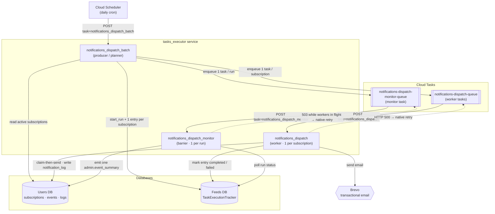

# Notification System — Architecture & Operations Guide

## Table of Contents

1. [Overview](#overview)
2. [Notification Types](#notification-types)
3. [Event Creation — Integration Points](#event-creation--integration-points)
4. [Dispatcher Tasks (Cloud Tasks fan-out)](#dispatcher-tasks-cloud-tasks-fan-out)
5. [Retry Strategy](#retry-strategy)
6. [Email Delivery — Brevo](#email-delivery--brevo)
7. [Admin Event Summary](#admin-event-summary)
8. [Future Work](#future-work)

---

## Overview

The notification system is **event-driven** and **application-level** (no database triggers).

```
Feed change happens
  │
  ├── feeds DB write          (existing, unchanged)
  └── users DB: notification_event  (new, best-effort)

           │
           ▼  Cloud Scheduler (daily)
   notifications_dispatch_batch       (producer / planner)
     • resolves cadences for today
     • finds active notification_subscriptions
     • registers a run in TaskExecutionTracker (feeds DB)
     • enqueues 1 Cloud Task per subscription + 1 monitor task
           │
           ├──▶ notifications_dispatch  (worker, 1 per subscription)
           │      • claim-then-send each pending event (lock-free, no duplicates)
           │      • sends emails via Brevo
           │      • records delivery in notification_log
           │      • reports completion to TaskExecutionTracker
           │
           └──▶ notifications_dispatch_monitor        (barrier, 1 per run)
                  • polls until every worker has reported (Cloud Tasks native retry)
                  • emits exactly ONE admin.event_summary with aggregated stats
```

**Two databases** are involved:
- **Feeds DB** (`FEEDS_DATABASE_URL`) — where feeds, redirects, and datasets live.
- **Users DB** (`USERS_DATABASE_URL`) — where users, subscriptions, events, and logs live.

Because these are separate PostgreSQL instances, event creation is **best-effort**: if the users DB write fails, the feed change is **not rolled back**. Failures are logged and can be monitored.

---

## Notification Types

| ID | Description |
|----|-------------|
| `feed.url_updated` | Fired when a feed URL changes in-place (`url_replaced`) or a feed is deprecated and redirected to another feed (`feed_redirected`). |
| `admin.event_summary` | Daily digest for admin subscribers summarising dispatcher run statistics. |

### `feed.url_updated` — `event_subtype` values

| `event_subtype` | Trigger |
|---------------|---------|
| `feed_redirected` | A new `Redirectingid` row is created; source feed is deprecated. |
| `url_replaced` | `Feed.producer_url` is updated in-place by automation or an operator. |

### `admin.event_summary` — `event_subtype` values

| `event_subtype` | Trigger |
|---------------|---------|
| `dispatch_summary` | Created after every non-dry-run dispatcher invocation. |


## Event Creation — Integration Points

`notification_event` rows (and their `notification_event_feed` rows) are created by calling helpers
from `shared/notifications/notification_event_service.py`.

### `emit_feed_redirected(source_stable_id, target_stable_id, old_url, new_url, source, extra_data=None)`
### `emit_url_replaced(feed_stable_id, old_url, new_url, source, extra_data=None)`

These wrap the generic `_emit(notification_type_id, event_subtype, source, feeds, payload)`.
`old_url`/`new_url` are stored in `payload`; the feed(s) become `notification_event_feed` rows.
Any `extra_data` is merged into `payload`.

Both functions are **fire-and-forget**: if `USERS_DATABASE_URL` is not set, or if the write fails, a warning is logged and the calling code continues normally.

> **Note — populate_db scripts and GitHub Actions CI**:
> The `populate_db_gtfs.py` and `populate_db_gbfs.py` scripts run as part of the
> `db-update-content.yml` GitHub Actions workflow.  This workflow currently only sets
> `FEEDS_DATABASE_URL`.  To enable notification events from these scripts,
> `USERS_DATABASE_URL` must be added to the workflow's environment.  Until then,
> the emit calls will log a warning and no-op, which does **not** break the populate run.

---

## Dispatcher Tasks (Cloud Tasks fan-out)

Dispatch is a **Cloud Tasks fan-out**, not a single monolithic task. Cloud
Scheduler triggers a **planner** that enqueues one **worker** per subscription
plus a single **monitor** that emits the run summary once the run drains. This
scales horizontally (workers run in parallel) and makes duplicate emails
structurally impossible under concurrency (lock-free claim-then-send).

**Files**: `functions-python/tasks_executor/src/tasks/notifications/`
— `dispatch_batch.py` (planner), `dispatch_worker.py` (worker),
`dispatch_monitor.py` (monitor). Shared query/send/log/claim helpers live in
`dispatch_notifications.py`.

### Topology — Cloud Scheduler, tasks_executor & Cloud Tasks

All three dispatch tasks are handlers hosted in the **same `tasks_executor`
service**; they are decoupled by **Cloud Tasks** queues. Cloud Scheduler kicks
off the run; the producer fans out into per-subscription worker tasks plus a
single monitor task, each of which calls back into `tasks_executor`.



| Task name | Role | Triggered by |
|-----------|------|--------------|
| `notifications_dispatch_batch` | Producer: resolve cadences, find subscriptions, register the run, enqueue workers + monitor | Cloud Scheduler |
| `notifications_dispatch` | Worker: claim-then-send one subscription's pending events | `notifications_dispatch_batch` (one task per subscription) |
| `notifications_dispatch_monitor` | Barrier: poll until the run drains, then emit one `admin.event_summary` | `notifications_dispatch_batch` (one task per run) |

## Retry Strategy

Durability plus three independent retry layers:

### Layer 0 — Commit after every send (crash durability)
The dispatcher commits the `notification_log` row **immediately after each email is sent** (after every single send, and after each digest). This guarantees that a crash, timeout (`attempt_deadline`), or DB error later in the run can never roll back the log of an email that was already delivered — bounding any duplicate to at most the one send in flight.

### Layer 1 — In-run retries (transient failures)
Each Brevo send attempt is retried **up to 3 times** within the same worker run with short back-off (1 s, 2 s, 4 s). Handles transient Brevo API errors, rate limits, and timeouts.

### Layer 2 — Cross-run retries (next scheduled run + Cloud Tasks)
Two mechanisms cooperate:
- **DB ledger**: a `failed` (non-permanent) `notification_log` row is re-claimed and retried by the next scheduled planner run (`status_filter` includes `failed` events whose `retry_count < max_retries`).
- **Cloud Tasks native retry**: if a *worker* task fails on an infrastructure error (HTTP 500), Cloud Tasks retries it per the queue's `retry_config`; the claim-then-send logic makes the redelivery a no-op for already-sent events.

### Layer 3 — Permanent failure (`retry_count >= max_retries`)
Once a log row reaches `retry_count >= max_retries` (default 5), it is marked `'permanently_failed'` and excluded from all future runs. Monitor for `permanently_failed` rows in dashboards or alerts.

### The ledger is the source of truth, not the queue
Cloud Tasks gives at-least-once *eventual* delivery, not a by-deadline guarantee, so completeness is anchored in the DB: a run is "done" when every pending event for an active subscription has a terminal `notification_log` row (`sent`/`permanently_failed`). The re-entrant planner re-publishes any stragglers on the next pass; the unique constraint + claim-then-send prevent duplicates; the monitor's `admin.event_summary` reports the outcome.


## Email Delivery — Brevo

The dispatcher sends emails via **Brevo Transactional Email API** (`sib_api_v3_sdk.TransactionalEmailsApi`).

**File**: `api/src/shared/notifications/brevo_notification_sender.py`


## Admin Event Summary

The **monitor task** (`notifications_dispatch_monitor`) emits **exactly one**
`notification_event` of type `admin.event_summary` / `dispatch_summary` per
dispatch run, once every worker has reported (or the run deadline passes). It
aggregates delivery stats from `notification_log` over the run window into
`payload`:

```json
{
  "subscriptions_processed": 42,
  "workers_failed": 0,
  "events_found": 18,
  "emails_sent": 17,
  "emails_failed": 1,
  "permanently_failed": 0,
  "incomplete_workers": 0,
  "cadence": "daily"
}
```

`incomplete_workers > 0` means the run hit its `deadline_seconds` cap before all
workers reported — the summary is still emitted (marked incomplete) so the run
terminates. Because the summary is created by the single barrier task keyed off
the run's `TaskExecutionTracker` state (and the run is marked complete
afterward), the **multiple-summary bug class is structurally impossible** — a
monitor redelivery sees the run already `completed` and is a no-op.

Admin users subscribe with `notification_type_id='admin.event_summary'` and
`cadence='daily'` to receive these as a daily digest.

## Future Work

- **`immediate` cadence**: Architecture is fully implemented. To activate, deploy a Cloud Scheduler job calling `notifications_dispatch_batch` with `cadence='immediate'` at the desired frequency (e.g. every 15 minutes). No code changes needed.
- **Additional notification types**: Add a new `notification_type` row, then call `_emit(notification_type_id, event_subtype, source, feeds=[...], payload={...})` in `notification_event_service.py` — no schema changes needed (feeds go in `notification_event_feed`, everything else in `payload`). The dispatcher, delivery, and retry infrastructure is reused automatically. For non-`feed.url_updated` types, add a Brevo subject/template mapping and a `build_params_*` / HTML renderer in `brevo_notification_sender.py`.
- **Operations API endpoint**: `GET /notifications/events` (paginated, filterable by type/date/source) for ops visibility into queued events. Belongs in the operations API, not the public API.
- **Unsubscribe link**: Pass `subscription_id` in Brevo template params; build a one-click unsubscribe endpoint that sets `notification_subscription.active = false`.
