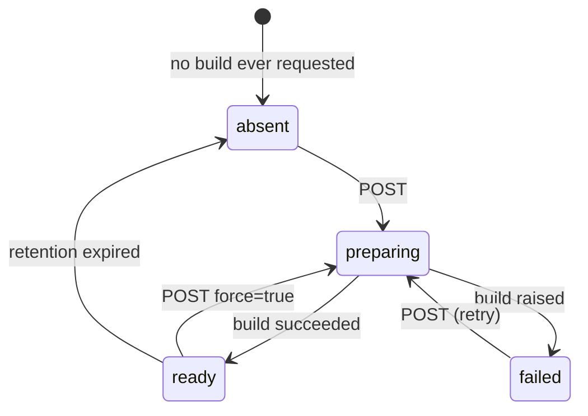
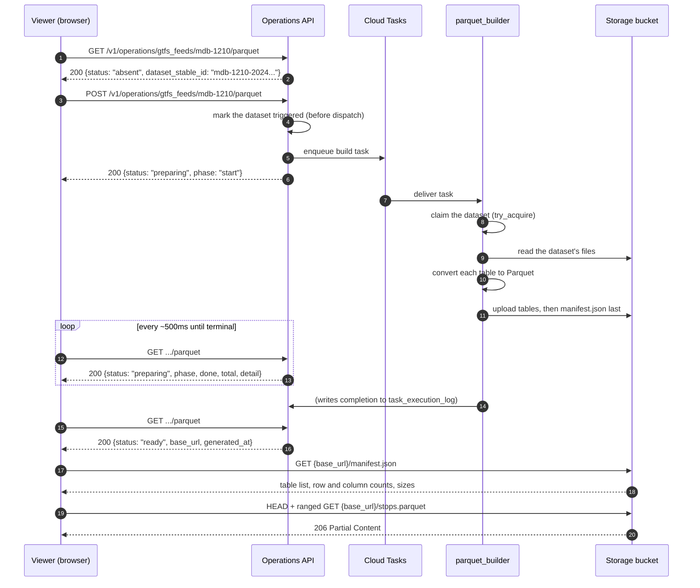
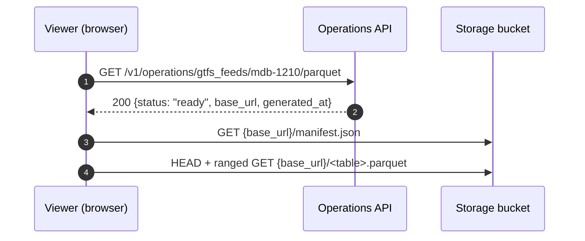
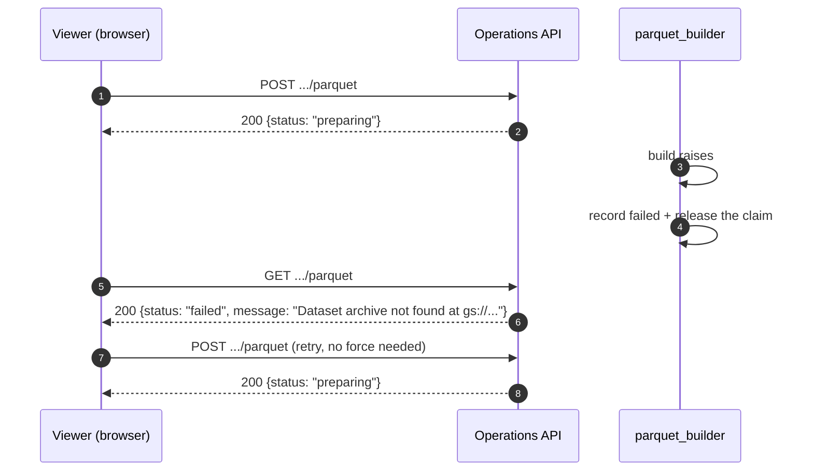

# Browsing a GTFS Feed - Operations API Flow

This document describes the calls a client makes to browse a GTFS feed: how it asks the
Operations API whether a dataset has been rendered as Parquet, how it starts a rendering
and follows its progress, and what it fetches from the storage bucket once one exists.

It is written for developers working in this repository. The only client today is the
operations web app, which lives in a separate repo and is referred to here as "the
viewer".

For how the conversion itself works - DuckDB, the claim on `task_execution_log`, memory
behaviour, retention, local generation - see
[functions-python/parquet_builder/README.md](../functions-python/parquet_builder/README.md).
This document is about **what a client calls and in what order**, not how the files are
produced.

Throughout, "**dataset**" means a `gtfsdataset` row addressed by its `stable_id` (for
example `mdb-1210-202402121801`), and "**feed**" means a `gtfsfeed` row addressed by its
own `stable_id` (`mdb-1210`). Every path parameter in this flow is a stable id, never a
UUID.

## Table of Contents

1. [Authentication](#authentication)
2. [Endpoint inventory](#endpoint-inventory)
3. [The state machine](#the-state-machine)
4. [Flow 1 - a feed that has never been converted](#flow-1---a-feed-that-has-never-been-converted)
5. [Flow 2 - a feed already converted](#flow-2---a-feed-already-converted)
6. [Flow 3 - a build that fails](#flow-3---a-build-that-fails)
7. [Polling](#polling)
8. [Progress fields](#progress-fields)
9. [Reading the output](#reading-the-output)
10. [Why the API does not return the table list](#why-the-api-does-not-return-the-table-list)
11. [Transport requirements for the files](#transport-requirements-for-the-files)
12. [Expiry](#expiry)
13. [Known deviations from the spec](#known-deviations-from-the-spec)
14. [Running it locally](#running-it-locally)

---

## Authentication

This is the part the spec will mislead you about, so it comes first.

**Every call, GET and POST alike, needs a Google OAuth2 bearer token:**

```
Authorization: Bearer <Google OAuth2 access token>
Content-Type: application/json          # POST with a body only
```

The token's `audience` must equal the `GOOGLE_CLIENT_ID` the function was deployed with
(`infra/functions-python/main.tf:879`). Validation happens in `RequestContextMiddleware`
(`functions-python/operations_api/src/middleware/request_context_middleware.py`), which
calls Google's `tokeninfo` endpoint and caches the result for the token's lifetime
(`functions-python/operations_api/src/middleware/request_context_oauth2.py:138-207`).
The Cloud Function is invokable by `allUsers`, so this middleware is the only gate.

What the spec says instead:

- the GETs declare `security: - Authentication: []`, and `Authentication` is **never
  defined** under `securitySchemes` (`docs/OperationsAPI.yaml:3842-3846`). It is a
  dangling reference, so the generated code fell back to the global scheme.
- the POSTs declare `ApiKeyAuth`, an `x-api-key` header. **Nothing reads it.**
  `get_token_ApiKeyAuth` (`functions-python/operations_api/src/feeds_gen/security_api.py:22-38`)
  is a generated stub whose body is `...`; it returns `None` and rejects nothing.

So do not send `x-api-key` expecting it to authenticate anything, and do not expect a
GET to be unauthenticated.

Preflight is handled before auth: `CORSMiddleware` is registered after
`RequestContextMiddleware` and therefore wraps it, so an `OPTIONS` request is answered
without a token (`functions-python/operations_api/src/main.py:44-58`).

---

## Endpoint inventory

### Resolving ids

There is no dataset list or search endpoint in the Operations API. Two calls can find a
feed:

| Method + path | operationId | Returns |
|---|---|---|
| `GET /v1/operations/feeds` | `getFeeds` | Paged feed list. `search_query` matches stable id, name and provider; `operation_status`, `data_type`, `offset`, `limit` |
| `GET /v1/operations/gtfs_feeds/{id}` | `getGtfsFeed` | One feed, including `latest_dataset` - the only Operations endpoint that hands back a dataset id |

In practice a browse client needs neither. The feed-scoped Parquet endpoints resolve
`feed.latest_dataset` server-side and echo the result back as `dataset_stable_id`, so a
client holding only a feed id can do the whole flow.

### The Parquet endpoints

| Method + path | operationId | Purpose |
|---|---|---|
| `GET /v1/operations/gtfs_feeds/{id}/parquet` | `getGtfsFeedParquet` | State of the feed's latest dataset |
| `POST /v1/operations/gtfs_feeds/{id}/parquet` | `generateGtfsFeedParquet` | Start a build for it |
| `GET /v1/operations/gtfs_datasets/{id}/parquet` | `getGtfsDatasetParquet` | State of one specific dataset |
| `POST /v1/operations/gtfs_datasets/{id}/parquet` | `generateGtfsDatasetParquet` | Start a build for it |

The feed and dataset variants are otherwise identical: same request body, same response
shape, same semantics. Pick the feed one unless you are deliberately addressing an older
dataset.

**GET never starts work.** It is side-effect free and safe to poll. **POST** is what
begins a conversion, and it is idempotent: called against a build already running it
reports that build rather than queuing a second one.

POST takes an optional body:

```json
{ "force": false, "retention_days": 7 }
```

- `force` (default `false`) rebuilds a dataset that is already `ready`, replacing the
  files. It has **no effect on a build in flight** - that one is reported as-is rather
  than restarted.
- `retention_days` (1 to 60) overrides how long the output is kept. Omit it and the
  builder applies its own default of 30 days. The schema deliberately declares no
  default so the value lives in one place.

A `retention_days` outside the range is a `422` from FastAPI's own body validation.

---

## The state machine

`GET` returns **200 for every state**, including `absent`. A `404` means something else
entirely: the feed or dataset does not exist. A client has to distinguish them, because
`absent` is the ordinary starting point of the whole flow.



Which fields carry a value depends entirely on `status`. Every key is present in the
response; the ones that do not apply are `null`.

| Field | `absent` | `preparing` | `ready` | `failed` |
|---|---|---|---|---|
| `status` | yes | yes | yes | yes |
| `feed_stable_id` | yes | yes | yes | yes |
| `dataset_stable_id` | yes | yes | yes | yes |
| `base_url` | - | - | **yes** | - |
| `generated_at` | - | - | **yes** | - |
| `phase` | - | **yes** | - | - |
| `done` | - | **yes** | - | - |
| `total` | - | **yes** | - | - |
| `detail` | - | **yes** | - | - |
| `message` | - | - | - | **yes** |

The state is derived from a single `task_execution_log` row keyed
`(task_name="parquet_generation", entity_id=<dataset stable id>, run_id=<converter version>)`
in `_state_of`
(`functions-python/operations_api/src/feeds_operations/impl/parquet_api_impl.py`):

| Row | Reported as |
|---|---|
| no row | `absent` |
| `completed`, `expires_at` in the past | `absent` |
| `completed`, not expired | `ready` |
| `failed` | `failed` |
| `triggered` or `in_progress` | `preparing` |

Two consequences worth knowing. A converter version bump changes `run_id`, so every
dataset built under the old version reads as `absent` and rebuilds on first request. And
a feed with no dataset at all is a **404**, not `absent`: `"GTFS feed has no dataset yet"`.

The `failed` message is the builder's exception string, surfaced verbatim so an operator
can act on it. When the row carries no message the API substitutes
`"The conversion failed."`.

---

## Flow 1 - a feed that has never been converted

The common case on first browse.



Points that matter to a client:

- The POST response already carries the state, in the same shape the GET returns. A
  client that only wants to start the work can ignore the body and poll.
- The dataset is marked `triggered` **before** the task is dispatched, so the very next
  poll reads `preparing` rather than `absent` again.
- If the enqueue fails, the POST is a `500` and the dataset is left `failed` rather than
  stuck `preparing`, so it stays retriable.

---

## Flow 2 - a feed already converted



No POST, no polling. A client should always GET first and only POST on `absent` or
`failed`.

A POST here returns the ready state untouched unless `force: true` is sent, in which case
the set is rebuilt and replaced. `force` cannot interrupt a build that is already
running.

---

## Flow 3 - a build that fails

A failed build is reported through the same GET, as `failed` with a `message`. Note that
the builder function itself returns HTTP 200 to Cloud Tasks even when the conversion
fails: nothing in the conversion fails in a way a retry would fix, so the reason is
recorded in the database rather than signalled by a status code.



`failed` is re-triggerable without `force`. The two causes a client will actually see:

- **`Dataset archive not found at gs://...`** - the dataset has no extracted files and no
  `.zip` in the bucket. The API cannot detect this up front; it checks only that the feed
  and dataset rows exist, so the error arrives through the build rather than from the POST.
- **`No GTFS tables could be converted for <dataset>`** - the archive held nothing
  usable.

---

## Polling

- Poll the GET. There is no webhook, no `Retry-After` and no rate limiting on this path.
- Roughly **twice a second** is the documented expectation and what the viewer does.
- The server throttles its own progress writes to at most one per second, except that a
  phase change is always written immediately. Polling faster than that just returns the
  same reading.
- A progress write that fails is logged and swallowed. A `preparing` reading can
  therefore go stale without the build having died, so do not treat an unchanging reading
  as failure. A build that really dies leaves its claim to expire and the row stays
  `in_progress`, which still reads as `preparing`.

---

## Progress fields

`phase` tells the client which step is running. The spec lists the enum in a different
order from the order they occur; the order below is what actually happens.

| `phase` | When | `done` / `total` | `detail` |
|---|---|---|---|
| `start` | Claim taken, nothing done yet | `0 / 0` | `""` |
| `convert` | Rewriting each table as Parquet | table index / table count | table name, e.g. `stop_times` |
| `upload` | Publishing `manifest.json` | `1 / 1` | `manifest.json` |
| `summarise` | Recording the result | `0 / 0` | `""` |

`total: 0` means "not knowable in advance", not "nothing to do".

Three phases a client will never observe, despite being in the enum:

- `download` - the archive is read over the network with ranged requests as members are
  needed, so there is no stage during which it is being fetched and nothing else.
- `extract` - members are unpacked lazily inside `convert`.
- `done` - written only together with completion, at which point the API reports `ready`
  and suppresses `phase` altogether.

---

## Reading the output

`base_url` is a public URL prefix with **no trailing slash and no query string**:

```
https://files.mobilitydatabase.org/mdb-1210/mdb-1210-202402121801/parquet
```

It can be used verbatim as a reader's base URL. That is deliberate: the reader rebuilds
each file's URL from the origin and path only, discarding any query string, so a signed
URL could not survive the round trip - which is why the objects are public instead.

Fetch `{base_url}/manifest.json` first. It is the dataset's description of itself and the
only place the table list, counts and sizes live.

```json
{
  "version": 2,
  "generated_at": "2026-09-17T22:41:03+00:00",
  "converter_version": "2",
  "source":  { "kind": "zip", "bytes": 4821334 },
  "totals":  { "uncompressed_bytes": 18422910, "stored_bytes": 903411 },
  "tables": [
    { "name": "stops", "file": "stops.parquet", "rows": 4821, "columns": 12,
      "bytes": 481223, "compressed_bytes": 92210, "parquet_bytes": 41880 }
  ]
}
```

| Field | Meaning |
|---|---|
| `version` | Manifest format version, integer, currently `2` |
| `generated_at` | ISO-8601 UTC, seconds precision |
| `converter_version` | The builder's converter version, a string. Matches the `run_id` of the tracking row |
| `source.kind` | `zip` or `folder` |
| `source.bytes` | Size of the originating archive, nullable |
| `totals.uncompressed_bytes` | Sum of table `bytes` where known |
| `totals.stored_bytes` | Sum of table `parquet_bytes` |
| `tables[].name` | Table name: the GTFS file stem (`stops.txt` to `stops`), plus `locations` for `locations.geojson` |
| `tables[].file` | `{name}.parquet` |
| `tables[].rows` | Row count, read from the Parquet footer |
| `tables[].columns` | Column count |
| `tables[].bytes` | **Source** file size, nullable |
| `tables[].compressed_bytes` | Size inside the zip. `null` for a folder source |
| `tables[].parquet_bytes` | Size of the written Parquet file |

**Version 2 is not a superset of version 1.** In v1 `bytes` meant the Parquet size; in v2
it means the source size and the converted size is `parquet_bytes`. Check `version`
before reading either, and do not add fields under an old number.

Each table is then `{base_url}/{file}`, that is `{base_url}/{name}.parquet`.

Two properties of the Parquet the reader depends on: **every column is text**, and an
**empty CSV field becomes NULL** rather than an empty string. A reader that filters with
`ILIKE` or `= ''` relies on both.

**The publish order is a contract.** Tables are uploaded first, `manifest.json` last, and
stale objects are pruned only afterwards. Treat the manifest's presence as the signal that
the set is complete, and do not probe the bucket for table names: on a first build, before
the API reports `ready`, probing can catch a partially published set. A client driven by
the API or by the manifest never sees one.

---

## Why the API does not return the table list

`ready` carries only `base_url`, never the tables. This is deliberate, not an omission: a
reader handed a table list skips `manifest.json` entirely, and the manifest is where the
row counts and sizes live - and with them the load report the viewer draws from them. The
builder does record the tables on the tracking row, for diagnostics, but they are not
served.

---

## Transport requirements for the files

The Parquet files are read directly by the browser, not proxied through the API, so the
bucket itself has to cooperate.

- **The objects are public**, set per object at upload. The datasets bucket uses object
  ACLs rather than uniform bucket-level access, so a refused ACL fails the build rather
  than being ignored - a `ready` state never advertises a `base_url` that answers 403.
- **The reader needs `HEAD` as well as ranged `GET`.** It probes each table with `HEAD`
  before reading the footer.
- **The bucket CORS config must allow both methods** (`infra/batch/main.tf`):

  ```hcl
  cors {
    origin          = ["*"]
    method          = ["GET", "HEAD"]
    response_header = ["*"]
  }
  ```

  GCS matches CORS methods literally and does not treat `HEAD` as a kind of `GET`. With
  `GET` alone the `HEAD` preflight comes back with no `Access-Control-Allow-*` headers at
  all and the browser blocks the request. The failure surfaces as an opaque
  `NetworkError: Failed to execute 'send' on 'XMLHttpRequest'` with no mention of CORS,
  and the viewer reports it as "no tables found" - so if a freshly deployed environment
  cannot load any table while the objects are plainly present, check this first.

  The CORS block lives in the `infra/batch` module, so it is applied by the
  `datasets-batch-deployer` workflow, not by a functions deploy.

---

## Expiry

Each build stamps every object it publishes with a GCS `customTime` of
`build time + retention_days`, and the bucket carries one lifecycle rule that deletes an
object once its own `customTime` has passed. The same instant is recorded on the tracking
row, which is what the API reads to report `absent` again on that date.

For a client this means a `base_url` is not permanent. A dataset that was `ready` last
month can read `absent` today, and the next POST rebuilds it. Lifecycle deletion is
asynchronous and GCS gives no promptness guarantee, so there is a window where the API
reports `absent` while the files are still present - harmless, since a rebuild overwrites
them.

---

## Known deviations from the spec

Live behaviour that contradicts `docs/OperationsAPI.yaml`. Trust this table over the spec
until they are reconciled.

| Deviation | Why |
|---|---|
| POST responds **200**, not the `202` the spec declares | The generated router sets no `status_code`, so FastAPI's default applies |
| GETs require a bearer token despite declaring an undefined `Authentication` scheme | `Authentication` is never defined under `securitySchemes`, so the generated code applied the global `ApiKeyAuth` dependency instead |
| `x-api-key` authenticates nothing | `get_token_ApiKeyAuth` is a generated stub with an empty body |
| An unauthenticated call returns **500**, not `401` | `RequestContextMiddleware` is raw ASGI middleware outside Starlette's exception handling, so its `HTTPException` reaches the Cloud Function wrapper and is returned as a 500 |
| `phase: "extract"` and `phase: "done"` never appear | `extract` is emitted only by a function with no remaining call sites; `done` is written with completion, when `phase` is suppressed |

---

## Running it locally

`functions-python/parquet_builder/README.md` has the full local walkthrough, including the
case where the Operations API itself is what you want to exercise. The short version is
that Cloud Tasks does not dispatch locally - the `PARQUET_BUILDER_QUEUE_M`/`_L` vars are
unset, so the enqueue is a logged no-op and the dataset sits at `preparing` - which means
the builder has to be invoked by hand in the queue's place.

To skip the API entirely and just get Parquet files a browser can read:

```bash
scripts/parquet-generate-local.sh mdb-1210 --serve   # http://localhost:8090
```

That serves the output with range support and the CORS headers a reader needs, neither of
which `python -m http.server` provides.
