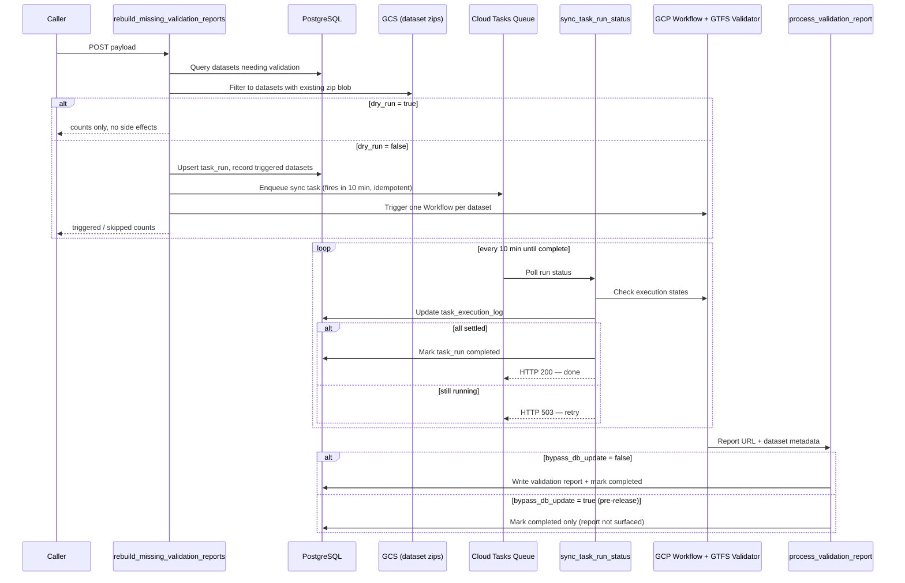

# GTFS Validation Report Tasks

This module contains two tasks for managing GTFS validation reports at scale:

| Task ID | Purpose |
|---|---|
| `rebuild_missing_validation_reports` | Triggers GCP Workflows to (re)validate datasets |
| `sync_task_run_status` | Generic self-scheduling monitor for any task_run |

---

## Architecture



---

## `rebuild_missing_validation_reports`

Finds GTFS datasets that are missing a validation report **or** have a report from an
older validator version, then triggers a GCP Workflow for each one.

The task is **resumable**: if it times out mid-loop, calling it again skips datasets
that were already triggered (tracked in `task_execution_log`).

### Payload

```json
{
    "dry_run": true,
    "validator_endpoint": "https://stg-gtfs-validator-web-mbzoxaljzq-ue.a.run.app",
    "bypass_db_update": false,
    "filter_after_in_days": 30,
    "filter_statuses": ["active"],
    "filter_op_statuses": ["published"],
    "force_update": false,
    "limit": 10,
    "reports_bucket_name": "stg-gtfs-validator-results"
}
```

| Field | Type | Default | Description |
|---|---|---|---|
| `dry_run` | bool | `true` | Count candidates only — no workflows triggered |
| `validator_endpoint` | string | env-derived | Validator service URL to use and fetch version from |
| `bypass_db_update` | bool | `false` | When `true`, results are NOT written to DB/API (use for pre-release runs) |
| `filter_after_in_days` | int | `null` | Restrict to datasets downloaded within the last N days. Omit to include all datasets |
| `filter_statuses` | list[str] | `null` | Filter feeds by status (e.g. `["active", "inactive"]`). Omit for all statuses |
| `filter_op_statuses` | list[str] | `["published"]` | Filter feeds by operational status. Accepted values: `"published"`, `"unpublished"`, `"wip"` |
| `force_update` | bool | `false` | Re-trigger even when a current report already exists |
| `limit` | int | `null` | Cap the number of workflows triggered per call — useful for end-to-end testing |
| `reports_bucket_name` | string | env-derived | Override the GCS bucket where validator results are stored. Use when running in prod but pointing to the staging validator (e.g. `"stg-gtfs-validator-results"`) |

---

## `sync_task_run_status`

Generic self-scheduling monitor for any `task_run` tracked by `TaskExecutionTracker`.
Automatically scheduled by `rebuild_missing_validation_reports` on every non-dry run.

### Behaviour

1. Polls GCP Workflows Executions API for all `triggered` entries with an `execution_ref`
2. Updates statuses (`triggered → completed / failed`)
3. If all done → marks `task_run.status = 'completed'`
4. If still in progress → re-schedules itself as a Cloud Task after `sync_delay_seconds`

### Payload

```json
{
    "task_name": "gtfs_validation",
    "run_id": "7.0.0",
    "sync_delay_seconds": 600
}
```

| Field | Type | Default | Description |
|---|---|---|---|
| `task_name` | string | **required** | Task name identifier (e.g. `"gtfs_validation"`) |
| `run_id` | string | **required** | Run identifier — the validator version string |
| `sync_delay_seconds` | int | `600` | Seconds between polling cycles |

### Response

Same as `get_validation_run_status` (which this task replaces):

```json
{
    "task_name": "gtfs_validation",
    "run_id": "7.0.0",
    "run_status": "in_progress",
    "total_count": 5000,
    "total_candidates": 5000,
    "dispatch_complete": true,
    "triggered": 200,
    "completed": 4800,
    "failed": 0,
    "pending": 0,
    "failed_entity_ids": [],
    "ready_for_bigquery": false
}
```

| Field | Meaning |
|---|---|
| `total_count` | Datasets intended to be triggered in the current call (respects `limit`) |
| `total_candidates` | Total datasets needing validation (before `limit` slicing) |
| `dispatch_complete` | `false` → `rebuild_missing_validation_reports` timed out; call it again |
| `pending` | Datasets not yet triggered (`> 0` means dispatch loop is incomplete) |
| `triggered` | Dispatched but report not yet processed |
| `ready_for_bigquery` | `true` when all workflows finished with no failures and task_run is marked completed |

---

## Pre-release Validator Analytics — Step-by-Step

This runbook generates analytics for a **new validator version** (pre-release) without
surfacing results in the public API (`bypass_db_update=true`).

### Prerequisites

- The staging validator is deployed at `https://stg-gtfs-validator-web-mbzoxaljzq-ue.a.run.app`
- You have the `validator_version` string (fetch from `<staging-url>/version`)

### Step 1 — Dry run (estimate scope)

```json
{
    "task": "rebuild_missing_validation_reports",
    "payload": {
        "dry_run": true,
        "validator_endpoint": "https://stg-gtfs-validator-web-mbzoxaljzq-ue.a.run.app",
        "bypass_db_update": true
    }
}
```

Check `total_candidates` in the response to understand the scale.

### Step 2 — End-to-end test with a small batch

```json
{
    "task": "rebuild_missing_validation_reports",
    "payload": {
        "dry_run": false,
        "validator_endpoint": "https://stg-gtfs-validator-web-mbzoxaljzq-ue.a.run.app",
        "bypass_db_update": true,
        "limit": 10
    }
}
```

### Step 3 — Monitor the test batch

```json
{
    "task": "get_validation_run_status",
    "payload": {
        "validator_version": "7.0.0",
        "sync_workflow_status": true
    }
}
```

### Step 3 — Monitor the test batch

`sync_task_run_status` is scheduled automatically by `rebuild_missing_validation_reports`.
You can also call it on demand to get the current status:

```json
{
    "task": "sync_task_run_status",
    "payload": {
        "task_name": "gtfs_validation",
        "run_id": "7.0.0"
    }
}
```

Verify `dispatch_complete: true` and `triggered` count decreases as workflows finish.

### Step 4 — Full run

Remove the `limit`. If the function times out, call it again — already-triggered
datasets are automatically skipped. The self-scheduling `sync_task_run_status` continues
polling in the background every 10 minutes:

```json
{
    "task": "rebuild_missing_validation_reports",
    "payload": {
        "dry_run": false,
        "validator_endpoint": "https://stg-gtfs-validator-web-mbzoxaljzq-ue.a.run.app",
        "bypass_db_update": true
    }
}
```

### Step 5 — Wait for completion

`sync_task_run_status` runs automatically every 10 minutes. The run is fully complete
when `ready_for_bigquery: true` (`dispatch_complete=true`, `pending=0`, `triggered=0`,
`failed=0`) and `task_run.status` is set to `completed`.

To check on demand:

```json
{
    "task": "sync_task_run_status",
    "payload": {
        "task_name": "gtfs_validation",
        "run_id": "7.0.0"
    }
}
```

### Step 6 — BigQuery ingestion

BigQuery ingestion runs on a fixed schedule (2nd of each month). To ingest immediately
after the pre-release run completes, trigger the `ingest-data-to-big-query` Cloud
Function manually:

```bash
curl -X POST "https://ingest-data-to-big-query-gtfs-563580583640.northamerica-northeast1.run.app" \
  -H "Authorization: bearer $(gcloud auth print-identity-token)" \
  -H "Content-Type: application/json"
```

---

## GCP Environment Variables

| Variable | Default | Description |
|---|---|---|
| `ENV` | `dev` | Environment (`dev`, `staging`, `prod`) |
| `LOCATION` | `northamerica-northeast1` | GCP region |
| `GTFS_VALIDATOR_URL` | env-derived | Override the validator URL (takes priority over `ENV`) |
| `BATCH_SIZE` | `5` | Number of workflows triggered per batch before sleeping |
| `SLEEP_TIME` | `5` | Seconds to sleep between batches |
| `TASK_RUN_SYNC_QUEUE` | Terraform-injected | Cloud Tasks queue used by `sync_task_run_status` self-scheduling |
